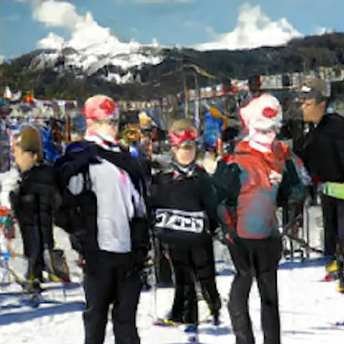

# text2img-compilation

This repo aims to compare the performance and capabilities of three notable text-to-image synthesis models: AttnGAN, DF-GAN, GALIP, and state of the art model like Stable Diffusion.
There is also an accompanying [medium article](https://medium.com/@pantnt/deep-learning-project-2-evolution-of-text-to-image-generation-e2170036a836), and [presentation slides](https://github.com/fordkuppp/text2img-compilation/blob/main/slides.pdf).

## Introduction

### AttnGAN

AttnGAN, or Attentional Generative Adversarial Network, uses an "attention mechanism" to focus on specific words while generating different parts of the image, leading to sharper and more detailed results compared to regular GANs. 

### DF-GAN

DF-GAN, or Deep Fusion Generative Adversarial Networks, simplified previously released models at a time by directly generating the high-resolution image at once, avoiding entanglements between generators. It also introduce Deep text-image Fusion Block.

### GALIP

GALIP, or Generative Adversarial CLIPs, use the pretrained CLIPs model in both generator and discriminator. CLIP (Contrastive Language-Image Pretraining) is an image classifier model trained by OpenAI.

## Comparison
### CUB-200-2011 (Birds)
| AttnGAN | DF-GAN    | GALIP    | Stable Diffusion [^1] |
| :---:   | :---: | :---: | :---: |
|  |    |    | 

### COCO
| AttnGAN | DF-GAN    | GALIP    | Stable Diffusion [^1] |
| :---:   | :---: | :---: | :---: |
|  |    |    | 

[^1]: Stable Diffusion doesn't use CUB or COCO datasets, it uses LAION dataset. 
